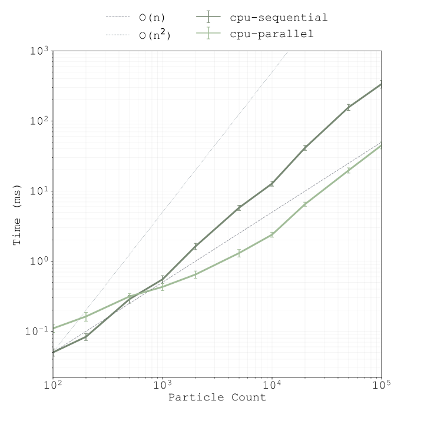
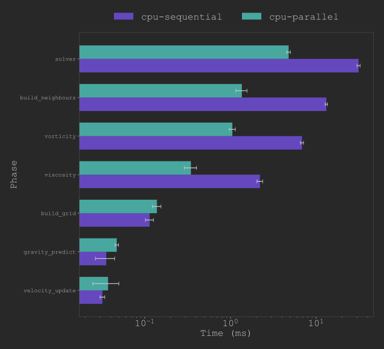

# 3D Fluid Simulation (C++/OpenGL)


---
[](https://ci.appveyor.com/project/lukasvarhol/fluid-sim/branch/master)

## Description

A real-time 3D fluid simulation built to practice C++, graphics programming, and performance optimisation. The simulation implements **Position Based Fluids (PBF)** based on [Macklin & Müller 2013](https://mmacklin.com/pbf_sig_preprint.pdf).

## Performance

The simulation was benchmarked using a custom profiler built into the binary, activated via the `--benchmark` flag. Each run measures per-phase wall-clock time across 2000 frames at a fixed timestep, logging raw per-frame timings to CSV for post-processing. The follwing results are true for running the benchmarks on an AMD Ryzen 9700X (8-core).

*NOTE: GPU support is WIP*

### Benchmark Hardware
| | |
|---|---|
| CPU | AMD Ryzen 7 9700X (8-core, 16-thread) |
| RAM | 64GB DDR5 5600 MT/s (Dual Channel) |
| Compiler | MSVC |
| Build type | Release |
| OS | Windows |

### Scaling Behaviour



### Per-Phase Breakdown (N=20,000)



---

## Controls

### Keyboard
| Key | Action |
|-----|--------|
| `SPACE` | Pause / Resume |
| `→` | Step one frame |
| `R` | Reset simulation |
| `ESC` | Toggle HUD |

### Mouse
| Input | Action |
|-------|--------|
| Left click + drag | Pull particles |
| Right click + drag | Push particles |
| Shift + Left drag | Orbit camera |
| Ctrl + Left drag | Pan camera |
| Scroll Wheel | Zoom in / out |

---

## Structure

```
src/
 ├── main.cpp              # OpenGL app + render loop
 ├── particles.*           # PBF simulation
 ├── particle_config.*     # Simulation parameters
 ├── linear_algebra.*      # Vec2 / Vec3 / Mat4 math
 ├── triangle_mesh.*       # Instanced quad mesh for particle rendering
 ├── grid.*                # Floor grid 
 ├── colors.h              # Particle colour ramp
 ├── cell.*                # Grid cell type
 ├── helpers.h             # Utility functions
 └── shaders/
 	  ├── grid_vertex.glsl
	  ├── grid_fragment.glsl
      ├── vertex.txt
      └── fragment.txt
benchmarks/
 ├── profiler.*            # Runtime profiler Util
 ├── run_benchmarks.ps1    # Build + run script (Windows)
 └── logs/                 # Benchmark CSV results
```

---

## Building
### Linux (NixOS Recommended)
##### Debian-based
###### Depedencies
```bash
sudo apt-get install build-essential libglfw3-dev libgl1-mesa-dev
```

##### NixOs
In the project root, just run:
``` bash
nix develop
```
That's it.

##### Configure and build
Quick build and run:
```bash
cmake -S . -B build -DCMAKE_BUILD_TYPE=Release
cmake --build build --target fluid-sim
```

###### Extra Compilation Flags
If your device supports CUDA, but for some reason you would like to run the CPU-only version, you cand disable all CUDA execution with `-DUSE_CUDA=OFF`.

##### Run
```bash
./build/fluid-sim
```

### Windows
##### Dependencies
Install vcpkg if you don't already have it:
```bash
cd C:\
git clone https://github.com/microsoft/vcpkg.git
cd vcpkg
.\bootstrap-vcpkg.bat
.\vcpkg install glfw3
.\vcpkg integrate install
```

##### Configure and build
```
cmake -S . -B build -DCMAKE_TOOLCHAIN_FILE=C:/vcpkg/scripts/buildsystems/vcpkg.cmake
cmake --build build --config Release
```

##### Run
```
.\build\Release\fluid-sim.exe
```

---

### Benchmarks
Windows:
```powershell
.\benchmark\run_benchmarks.ps1
```
---

## Dependencies

- [GLFW](https://www.glfw.org/) — windowing and input
- [GLAD](https://glad.dav1d.de/) — OpenGL loader
- [Dear ImGui](https://github.com/ocornut/imgui) — runtime HUD for parameter tuning

---

## References

- Macklin, M. & Müller, M. (2013). *Position Based Fluids*. ACM Transactions on Graphics, 32(4).
- Green, S. (2010). Particle Simulation using CUDA. NVIDIA Developer Technical Report.

