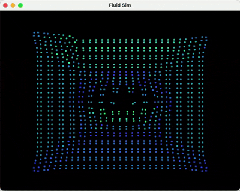

# 2D Fluid Simulation (C++/OpenGL)



---

## Description

A real-time 2D fluid simulation built to practice C++, graphics programming, and performance optimisation. The simulation implements **Position Based Fluids (PBF)** based on [Macklin & Müller 2013](https://mmacklin.com/pbf_sig_preprint.pdf).

The simulation runs on the CPU and currently sustains ~7,000 particles at real-time frame rates. Performance was achieved through a series of targeted optimisations:

- **Spatial hashing** with a flat grid structure reduces neighbour search from $O(N^2)$ to $O(kN)$, where $k$ is the average neighbour count within the smoothing radius
- **Flat neighbour lists** with fixed-size per-particle buffers replace `vector<vector<T>>` for cache-friendly access and fully parallel neighbour construction
- **Verlet neighbour list** skips neighbour rebuilds on frames where no particle has moved more than a skin radius threshold, reducing grid+neighbour cost from ~22ms to ~0.2–1.7ms per frame
- **Parallelised solver loops** using `std::execution::par_unseq` across lambda, delta, XSPH, and vorticity passes
- **Precomputed kernel constants** (`h2`, `h5`, `h8`, `poly6_norm`, `spiky_norm`) eliminate redundant `powf` calls in the inner loops

Scaling and performance were verified through Google Benchmark across N=200 to N=4000, confirming $O(n)$ behaviour. Results are plotted in `benchmarks/benchmark_plotting.ipynb`.

The plan is to port the simulation to CUDA for a 3D real-time implementation with semi-realistic rendering as part of a group project.

---

## Controls

| Key | Action |
|-----|--------|
| `SPACE` | Pause / Resume |
| `→` | Step one frame |
| `R` | Reset simulation |

---

## Structure

```
src/
 ├── main.cpp              # OpenGL app + render loop
 ├── particles.*           # PBF simulation
 ├── linear_algebra.*      # Vec2 / Vec3 / Mat4 math
 ├── triangle_mesh.*       # Rendered quad mesh
 ├── colors.h              # Particle colour ramp
 ├── cell.*                # Grid cell type
 ├── helpers.h             # Utility functions
 └── shaders/
      ├── vertex.txt
      └── fragment.txt
benchmarks/
 ├── benchmark.cpp         # Google Benchmark tests
 ├── run_benchmarks.ps1    # Build + run script
 ├── benchmark_plotting.ipynb
 └── data/                 # Benchmark CSV results
```

---

## Building
### Linux
##### Depedencies
```bash
sudo apt-get install build-essential libglfw3-dev libgl1-mesa-dev
```

##### Configure and build
```bash
cmake -S . -B build -DCMAKE_BUILD_TYPE=Release
cmake --build build --target fluid-sim
```

##### Run
```bash
./build/fluid-sim
```

### Windows
##### Dependencies
Install vcpkg if you don't already have it:
```bash
cd C:\
git clone https://github.com/microsoft/vcpkg.git
cd vcpkg
.\bootstrap-vcpkg.bat
.\vcpkg install glfw3
.\vcpkg integrate install
```

##### Configure and build
```
cmake -S . -B build -DCMAKE_TOOLCHAIN_FILE=C:/vcpkg/scripts/buildsystems/vcpkg.cmake
cmake --build build --config Release
```

##### Run
```
.\build\Release\fluid-sim.exe
```

---

### Benchmarks
Windows:
```powershell
.\benchmarks\run_benchmarks.ps1
```
Unix:
```bash
.\benchmarks\run_benchmarks.sh
```

---

## Dependencies

- [GLFW](https://www.glfw.org/) — windowing and input
- [GLAD](https://glad.dav1d.de/) — OpenGL loader
- [Google Benchmark](https://github.com/google/benchmark) — fetched automatically via CMake FetchContent

---

## References

- Macklin, M. & Müller, M. (2013). *Position Based Fluids*. ACM Transactions on Graphics, 32(4).
- Green, S. (2010). Particle Simulation using CUDA. NVIDIA Developer Technical Report.

